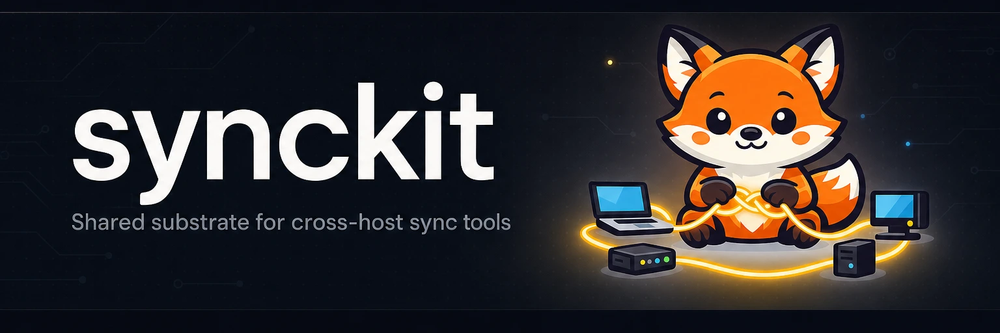

# synckit



[](https://github.com/yasyf/synckit/actions/workflows/ci.yml)
[](https://github.com/yasyf/synckit/blob/main/LICENSE)

synckit is the shared Go substrate behind [reposync](https://github.com/yasyf/reposync) and cookiesync — the host-mesh registry, convergent state store, unix-socket RPC, launchd service manager, and anti-echo watch engine that any "keep X in sync across my machines" tool needs. Both tools import one substrate, so the wire formats, lock semantics, and daemon plumbing that must stay byte-identical for two daemons to interoperate are defined once and tested once.

## Install

```bash
go get github.com/yasyf/synckit
```

synckit is a library, not a command. It ships no binary; you import the packages your daemon needs.

## Quickstart

A unix-socket RPC server with the peer-UID check, 16 MiB line bound, and read/dispatch timeouts already wired:

```go
import "github.com/yasyf/synckit/rpc"

d := rpc.NewDispatcher()
d.Register("ping", func(ctx context.Context, p map[string]any) (any, error) {
    return map[string]any{"pong": p["msg"]}, nil
})

ln, _ := rpc.Listen("/tmp/app.sock")
go rpc.Serve(ctx, ln, d)

resp, _ := rpc.Call(ctx, "/tmp/app.sock", &rpc.Request{
    Method: "ping",
    Params: map[string]any{"msg": "hi"},
})
// resp.Result == map[string]any{"pong": "hi"}
```

## What's inside

- A `{method,params}` unix-socket RPC with a peer-UID check, a 16 MiB line bound, and read/dispatch timeouts.
- A host-mesh registry with Tailscale and Bonjour discovery and an SSH transport.
- A flock-guarded state store where each tool writes only its own keys and preserves every sibling key byte-for-byte.
- A canonical Go-duration codec and the fan-out and timeout constants two daemons must agree on, defined once.
- A generic anti-echo watch engine that records the applied fingerprint before it notifies, so it never chases its own writes.

Two tools import one substrate, so none of this can drift between them.
