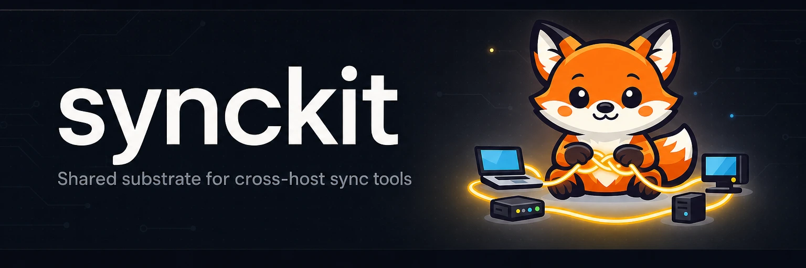

# 

**Your file watcher just synced its own write. Again.** synckit, the Go substrate under reposync and cookiesync, ships anti-echo watching, unix-socket RPC, a host mesh, and flock-backed state, each written once.

[](https://github.com/yasyf/synckit/actions/workflows/ci.yml)
[](https://github.com/yasyf/synckit/releases)
[](LICENSE)

## Get started

```bash
go get github.com/yasyf/synckit
```

A persistent RPC suite with exact build admission, same-UID trust, multiplexing,
and bounded 16 MiB payloads is already wired. Register product methods, then pass
the dispatcher, daemonkit program, and product preparation callback to
`helperruntime.New`:

```go
package main

import (
	"context"

	"github.com/yasyf/synckit/rpc"
)

func dispatcher() *rpc.Dispatcher {
	d := rpc.NewDispatcher()
	d.Register("ping", func(ctx context.Context, p map[string]any) (any, error) {
		return map[string]any{"pong": p["msg"]}, nil
	})
	return d
}
```

Driving with an agent? Paste this:

```text
Run `go get github.com/yasyf/synckit`, then use its rpc package to stand up a
unix-socket server: register handlers on `rpc.NewDispatcher` and compose the
dispatcher with `helperruntime.New`, whose `helperruntime.Spec` derives the
socket from the helper's launchd label. Call it from another process with
`syncservice.Resident(name)`, or open that same spec yourself —
`daemonkit.Open(spec)`, then `rpc.NewClient(rpc.ClientConfig{Open: ...})` over
the client's `Business` lane. Listener ownership, publication admission,
readiness, trust, and bounded framing stay in daemonkit.
```

---

## Use cases

### Build a keep-X-in-sync daemon without rewriting the plumbing

Every "keep X in sync across my machines" tool re-implements the same daemon: a socket server, host discovery, launchd plists, a reconcile tick, a watch supervisor. Ship a manifest instead:

```bash
brew install yasyf/tap/synckitd
synckitd register manifest.json
```

`synckitd` installs the manifest under `~/.config/synckit/manifests` and drives your tool's typed sync service — list, reconcile, sync — through either a resident Unix socket or a socketpair-confined local spawned session. Remote calls use Synckit's fixed `rpc-serve-v1` command over strict host-key-pinned SSH. The daemon never imports your code.

Process-backed transports are private to `synckitd` and run within a daemonkit
`Ctx` or `Owned` scope. Resident socket helpers use `helperruntime.New` with their
daemonkit `Program`, dispatcher, frame limit, and a preparation callback that
receives the `Ctx`.

### Watch files without chasing your own writes

Your daemon writes a file, fsnotify fires, the watcher syncs the write it just made, and around it goes. The watch engine breaks the loop:

```go
eng := watch.NewEngine(resolver, notifier, digest, 2*time.Second, peers)
eng.OnEvent(ctx, id)
```

The engine debounces, dedupes on the resolved fingerprint, and records what it applied *before* notifying peers — so the echo of its own write resolves to the recorded fingerprint and dies there instead of fanning out again.

### Merge state from every peer without a write storm

Push-based sync between two daemons is a feedback loop: each write triggers the other's. `converge.Reconcile` is pull-only:

```go
results, err := converge.Reconcile(ctx, lock, driver, fetcher, peers, origin)
```

A pass fetches every peer's registry read-only, folds them in with the CRDT merge (a LWW-element-set join), and performs exactly one write: the local `SaveRegistry`. Merge in any order and every replica lands on the identical registry; an unreachable peer is logged and skipped, never fatal.

## The packages

| Package | What it holds |
|---|---|
| `rpc` | Exact persistent daemonkit sessions carrying typed `{method,params}` calls with same-UID trust and bounded frames |
| `syncservice` | The typed sync contract over `rpc`, artifact-aware v2 export and apply, and the resident socket transport |
| `artifact` | Per-service content-addressed stores, resumable zstd batches, pins, and garbage collection |
| `delivery` | The daemon's delivery status and kick client API |
| `netpolicy` | Network.framework monitoring and the network cost policy for artifact transfers |
| `watch` | The generic anti-echo watch engine: debounce, fingerprint dedupe, record-before-notify, concurrent peer fan-out, busy gating |
| `watchbackend` | Filesystem events mapped to watch ids over recursive fsnotify (inotify/kqueue) |
| `hostregistry` | The host mesh: reachability detection, Tailscale and Bonjour discovery, an ssh runner, flock-guarded `state.json` |
| `cregistry` | LWW-element-set CRDT registry with per-item payloads; pure and clock-free |
| `converge` | The pull-only convergent-reconcile pass over a `cregistry` registry |
| `manifest` | The JSON manifest a consumer registers, plus discovery and validation |
| `daemon` | The `synckitd` command tree, daemonkit lifecycle runtime, and product-specific typed LaunchAgent policy |
| `codec` | Config-free JSON codecs, e.g. the canonical Go-duration string |
| `tui` | Shared bubbletea terminal UI: a tab router plus the built-in Hosts tab |

reposync and cookiesync import this one substrate, so the wire formats, lock semantics, and fan-out constants two daemons must agree on byte-for-byte are defined once and tested once.

## The synckitd daemon

`synckitd` is the one per-machine daemon behind every consumer: it owns the shared host mesh, the RPC socket, the reconcile tick, and the watch supervisor. `synckitd status` prints the mesh, registered manifests, the label-derived socket paths, and daemon liveness; `synckitd --help` carries the full command surface.

### Register an artifact consumer

Implement `syncservice.ArtifactConsumer` and register it with
`syncservice.RegisterArtifactConsumer(dispatcher, consumer, store, monitor)`.
The registration exposes `export.v2` and `apply.v2` together with the artifact
methods. Artifact changes are snapshots; the v1 export and apply methods reject
changes that carry artifact roots.

Get the consumer's store path from `artifact.ServiceRoot(serviceID)` and pass it
to `artifact.Open`. The store holds `store.lock` until `Close`.
`Store.Put` splits content into fixed 1 MiB blobs and returns a manifest root;
unchanged chunks retain their content addresses. `Store.PutGroup` groups roots.

| Stored or transferred data | Limit or format |
|---|---|
| Blob | At most 1 MiB |
| Encoded manifest | At most 1 MiB |
| Batch | At most 32 MiB of uncompressed object bytes in a zstd-compressed SKP1 pack |
| Compressed transport part | At most 1 MiB |

`Store.SetPins` retains the objects reachable from an owner's roots.
`Store.GC` preserves pinned closures and objects written or touched within the
24-hour `artifact.GCGrace`, including the descendants of retained manifests.
It also removes batch staging untouched for 24 hours. Call `SetPins` with an
empty root list to release an owner's pins.

`ChangeEnvelope.Artifacts` lists roots in consumer priority order.
`syncservice.BindDelivery` binds the root count and each root's kind, digest,
and size, in that order, into `ChangeID` under the v2 hash domain. Changes with
no artifact roots retain their v1 IDs.

`apply.v2` computes readiness from the receiver's store and passes only complete
roots to `ApplyArtifacts`. The consumer must derive the roots from the payload
again and reject a mismatch. It may report a partial apply, but acknowledging
`SourceRevision` while any root closure is missing returns
`syncservice.ErrIncompleteAck`.

### Observe and request delivery

`synckitd serve` runs a delivery worker for each configured pair of service and peer.
Artifact workers coalesce kicks for 10 seconds from the first unrun kick;
later kicks do not postpone the deadline. V1 workers run without that delay.
Each worker keeps one pending change, replacing it when a newer export arrives.
A kick during transfer causes a new export at the next batch boundary after
at least one batch completes. Interrupted batches resume from parts the peer
already holds, and transfers send only missing objects.

The `delivery` package calls the running daemon over RPC.

| API | Behavior |
|---|---|
| `delivery.Status(ctx, serviceID)` | Returns `[]delivery.PeerStatus` and an error; an empty service ID selects all services |
| `delivery.Kick(ctx, serviceID, peer)` | Queues delivery and returns an error; an empty service ID or peer selects all services or peers |

`PeerStatus` includes the pending change and acknowledged revision, plus live
progress, pause reasons, network observations, and the next attempt time.
Use `PeerStatus.Acked` to check whether the peer has acknowledged a source
revision. A successful kick only queues work. `synckitd reconcile` also requests
delivery from the running daemon and fails if the daemon is unavailable.

### Inspect network policy

On macOS, `netpolicy.NewMonitor` observes the default path through
Network.framework. Artifact transfer requires both endpoints to report a
connected route with no expensive, constrained, cellular, or manual metered
flag. Unknown network state pauses transfer.

The receiver checks its live policy on every `batch.begin` and `batch.put`,
including each compressed part, before writing. It also checks the sender's
declared state. `apply.v2` refuses requests while the receiver is restricted.
Paused workers recheck after 60 seconds or a local network change; failures
back off from 30 seconds to 5 minutes.

| Command | Effect |
|---|---|
| `synckitd net status --json` | Reports the local network state and each peer's transfer verdict or error as JSON |
| `synckitd net metered on` | Persists a manual metered setting for every network this host joins |
| `synckitd net metered off` | Clears the manual setting; OS cost flags still apply |

### Test delivery in process

`daemon.NewHarness(ctx, cfg)` returns `(*daemon.Harness, error)` and runs the
delivery workers and v2 state store for an in-process mesh. Tests provide
transports and monitors in place of SSH, launchd, and the host registry.

`daemon.HarnessConfig.Hosts` contains `daemon.HarnessHost` values with a mesh
`Name`, a separate `StateDir`, a `netpolicy.Monitor`, and a `Services` map from
service names to local `syncservice.Transport` values. `Manifests` declares
those services. `Links(from, to, service)` returns a fresh peer transport for
each attempt; `Harness` closes that transport afterward. Tests can inject
link failures through this callback.

Set `RetryInterval` to a positive duration for paused and failed workers.
`ArtifactMaxWait` controls kick coalescing. Each configured worker is scheduled
at startup, and the constructor's context bounds the worker's lifetime.

| `Harness` method | Behavior |
|---|---|
| `Kick(service, from, to)` | Queues work from a host; an empty service or destination selects all services or peers |
| `Status(host, service)` | Returns that host's delivery statuses; an empty service selects all services |
| `WaitIdle(ctx, host, service, peer)` | Returns the selected worker's `delivery.PeerStatus` once it has no queued kick or running attempt and is idle or paused |
| `Close()` | Stops workers and waits for active attempts before closing local service transports |

`WaitIdle` can return a paused worker that has scheduled a retry. Check the returned
`State` and `Acked` to distinguish a pause from an acknowledged revision.
Failed workers keep retrying while `WaitIdle` waits; the supplied context bounds
that wait. The caller owns the monitors and artifact stores and closes them
after calling `Harness.Close`.

Status: pre-1.0 — the API still moves between minors. Licensed under [PolyForm Noncommercial 1.0.0](LICENSE).
